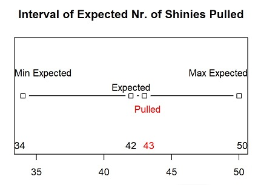
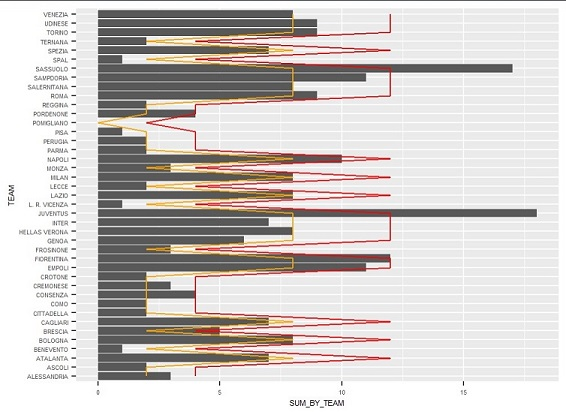
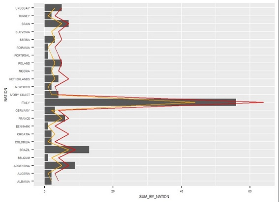
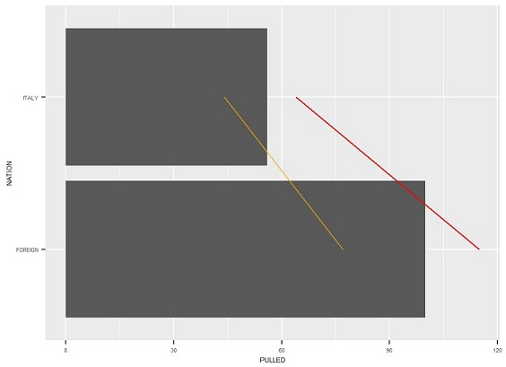

```{r setup, include=FALSE}
knitr::opts_chunk$set(echo = FALSE)
```

# Calciatori 2021-2022 Sticker Collection Data Analysis

## Background - Why I analysed a sticker collection?

I'm Bruno, a Portuguese Erasmus student and I have always collected
football stickers since I remember.

Every two years I do the figurine
collections from the Euros and the World Cups.

Since I'm doing Erasmus
in Italy and since Panini (the distributor of the collections) is
Italian I decided to start the collection.

## Background - Why I analysed a sticker collection?

However, I haven't answered the question above. Why did I **analyse** a
sticker collection?

Just two reasons!

1. In my first packet, the first sticker I saw was the Udinese Crest, what are the odds of that?\n
Well, it's obviously 1 over
how many stickers there are, right? It makes sense, it could be but
throughout all my years collecting stickers I have thought many times:\n
"No way this is **just** probability" Well, about time I can analyse
some of my doubts.
2. Because I had this project, obviously!

## What am I analyzing?

I have 3 questions I want to answer in this project:

1.Are shiny stickers rarer than non-shiny stickers?

-  Some collectors treat shiny stickers as rarer than non-shiny
    stickers and value them more in trades, is this true?
    
2.Are the packets weighted for each region/city?

-  In past collections, I had the page for Portugal mostly full while
    others were mostly empty, is this probability or something else?
    
3.Are Italian players more likely to be in packets?

-  In the same thought as the previous question, we could have Italian
    players be more likely to come out of packets.

## Base of this project

-   The Dataset only has stickers that could be pulled in the base
    packets (some stickers only come in special releases)
-   The collection contains stickers with "letter variants" (for
    example, sticker 667 has 3 stickers in it, sticker 667a, 667b,
    667c). These stickers will be counted as one.
-   The analysis will be surrounded on 250 stickers I pulled from
    packets only bought in Udine (in order not to mess with Question 2)
-   To consider a group of stickers more/less probable, I will count 20% of
    variance from the expected pull-off rate

## The Dataset

The Dataset contains 7 columns and a line for each sticker:

- **Number** : Number of the sticker on the collection (even if the
sticker is special and contains letters)
- **Times Pulled** : Number of
times I pulled a certain sticker off packet
- **Type** : Type of the
sticker, if it's a special sticker, a player, manager, crest, etc.
- **Shiny** : Tells if the sticker is shiny or not.

## The Dataset

The Dataset contains 7 columns and a line for each sticker:

- **Team** : The team
associated with this sticker (marked as ND if none)
- **Nation** : The
nation of the person (player or manager) of this sticker (stickers with
multiple players don't count and are marked as ND, as it is for any
other sticker without nationality)
- **Name** : Name of the sticker

## Question 1 - Are shiny stickers rarer than non-shiny stickers?

To understand if shiny stickers are rarer than non-shiny stickers we have
first of all know how many stickers are shiny and what's the proportion
to non-shiny stickers.

 

## Question 1 - Are shiny stickers rarer than non-shiny stickers?

To answer this question we have to **filter** our main dataset into two
sub-datasets, one only with shinies and one only with non-shinies.

There we will do something we'll use throughout the project:
**decimal_collection** which is the percentage of stickers I have
assuming non-doubles, in decimal form. It will be a constant used to
expectate how many stickers of a certain category I should have
pulled-off.

This constant will be: **0.3378378** (or 33.78%)

With this constant we calculate the expected number of shinies and
non-shiny stickers I should've pulled out of packets.

## Question 1 - Are shiny stickers rarer than non-shiny stickers?

To really answer the question I have to estimate the acceptable
variation off the expected value because we know probability isn't
certain (The 20% mentioned earlier)

The output of these calculations say that the number of shinies I pulled
will be considered normal if I have pulled between **34** and **50** shinies.

## Question 1 - Are shiny stickers rarer than non-shiny stickers?

I also had to calcuate how many shinies I pulled: **43** shinies! The
expected values were between **34** and **50** shinies, confirming that shinies
are **NOT** rarer than any other figuirine.



## Question 2 - Are the packets weighted for each region/city?

To answer this question, I will first filter stickers associated with a
team.

Then I calculate the expected stickers pulled by team and respective
minimum and maximum expected.

For this one I subtracted 1 to the minimum expected and added 1 to
maximum expected for teams with expected stickers pulled of 5 of less,
so I don't have cases where the minimum and maximum expected is the
same, and having pulled a different number of stickers of that team
would be considered abnormal.

I proceeded by also counting how many stickers I had pulled form each
team.

## Question 2 - Are the packets weighted for each region/city?

Now I have a full table I can analyse but I have also done a graph.

The bars are the stickers I pulled for each team, orange line the
minimum number of stickers I should pull to be considered normal, and the
red line is exactly the same but for the maximum value.

## Question 2 - Are the packets weighted for each region/city?



## Question 2 - Are the packets  weighted for each region/city?

To answer the question, packets are **NOT** weighted for the city of
purchase.

After this experiment we can conclude that 20% isn't much
since many teams are outside of the "normal" interval.

The teams are: **Atalanta**, **Benevento**, **Brescia**, **Cagliari**,
**Genoa**, **Inter**, **Juventus**, **L.R. Vicenza**, **Pisa**,
**Sassuolo**, **SPAL** and **Spezia**.

**Pordenone** and **Udinese** (the two teams of the region) had a
"normal" pull-off rate.

## Question 3 - Are Italian players more likely to be in packets?

For this final question I started by counting how many stickers each
nationality had in the Serie A (not counting Serie B because of the
triple-stickers mentioned previously)

Although we are going to answer if Italian players are more likely to be
in packets than foreigner players, we will do this first for each
nationality with at least 5 players in the collection (to avoid the
extreme cases, similar to what I did with the teams)

This excludes 37 nationalities and let's us study the top 23
nationalities. The discarded nationalities will come back once I make a
comparision between Italians and Foreigners

## Question 3 - Are Italian players more likely to be in packets?

Like previously done with teams, now I'll calculate the expected number
of stickers pulled for each nationality and respective minimum and
maximum number. I will also calculate the number of stickers I pulled
for each nation aswell.

Just like before I did a graph to better illustrate the values. The bars
and colored lines represent the same as before (stickers pulled for the
bars, minimum expected number of stickers pulled for the orange line and
maximum expected number of stickers pulled for the red line)

## Question 3 - Are Italian players more likely to be in packets?



## Question 3 - Are Italian players more likely to be in packets?

As for the question, Italian players are **NOT** more likely to be
pulled off packets.

However, as has happened previously, 20% interval wasn't
enough and some nations had "abnormal pullout rates".

These nations (with
at least 5 stickers in the collection) with abnormal pullout rates were: **Argentina**, **Belgium**,
**Brazil**, **Croatia**, **Portugal** and **Slovenia**.

## Question 3 - Are Italian players more likely to be in packets?

I also wanted to compare Italian Players with Foreigner players. We can see there wasn't a difference.



## Conclusions and Final Comments

With this project I confirmed that at least for me the packets were
**NOT** weighted for the **shiny-rate**, a **specific team** or a
**specific nation**.

## Conclusions and Final Comments

Even though I just answered all questions I initially asked I can't
confirm my answers for some reasons:

- We can obviously study many more variables
- The 20% interval I used
seemed to be a low interval margin (although it seemed adequate for the
amount of stickers in the database)

## Conclusions and Final Comments.

This study could be improved with:

- Finding oddities in the dataset and
testing them to see if they are true.

- Having more stickers to work
around, instead of "just" 250 stickers (34% of the total collection), we
would be better in having way more stickers than the full collection (I
would say 10 times the collection = 7400 stickers) but that would be way
more than 1000€!

- With more stickers to work I would've reduced the error interval from
the 20%

# Thanks for the attention! Any questions?